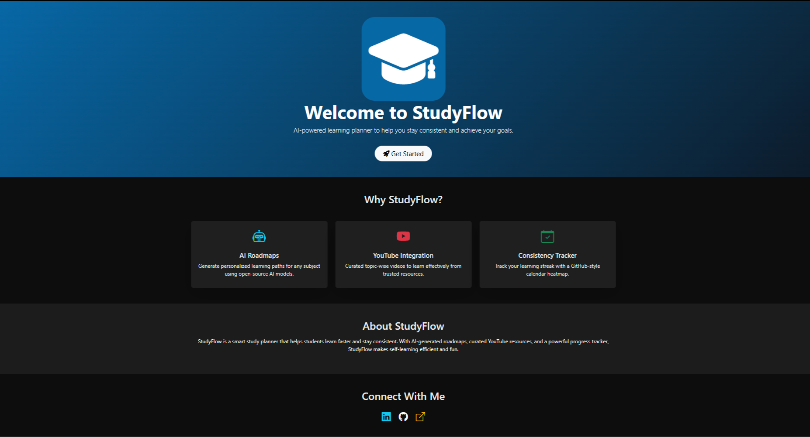
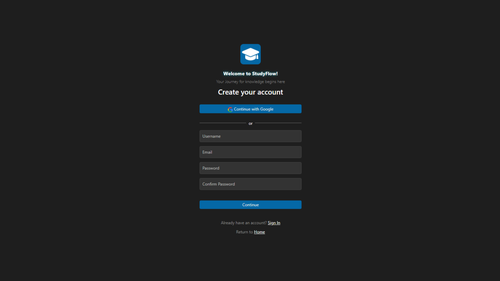
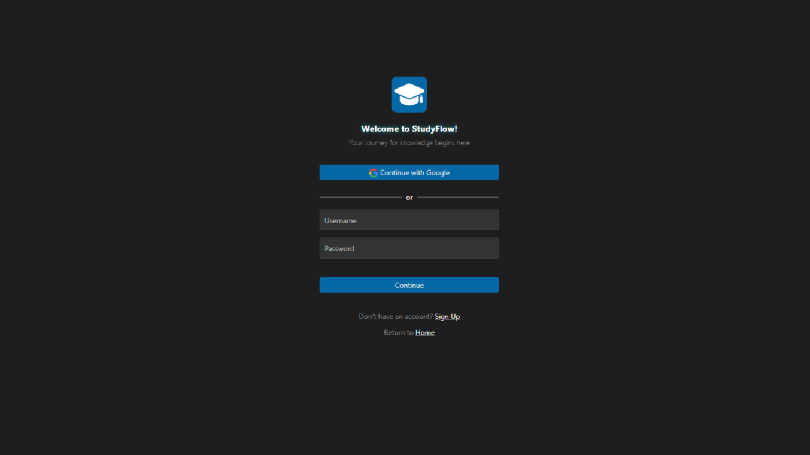
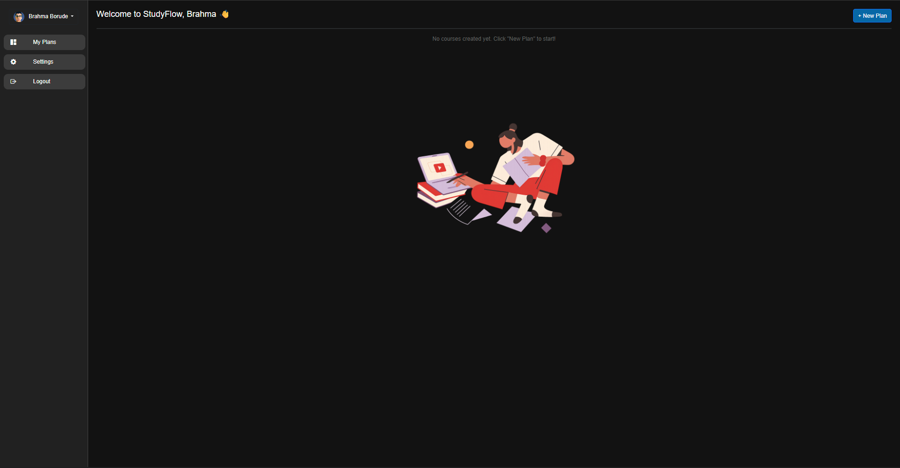
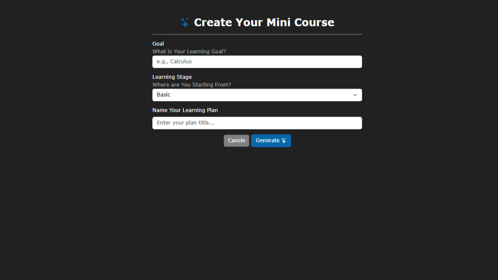
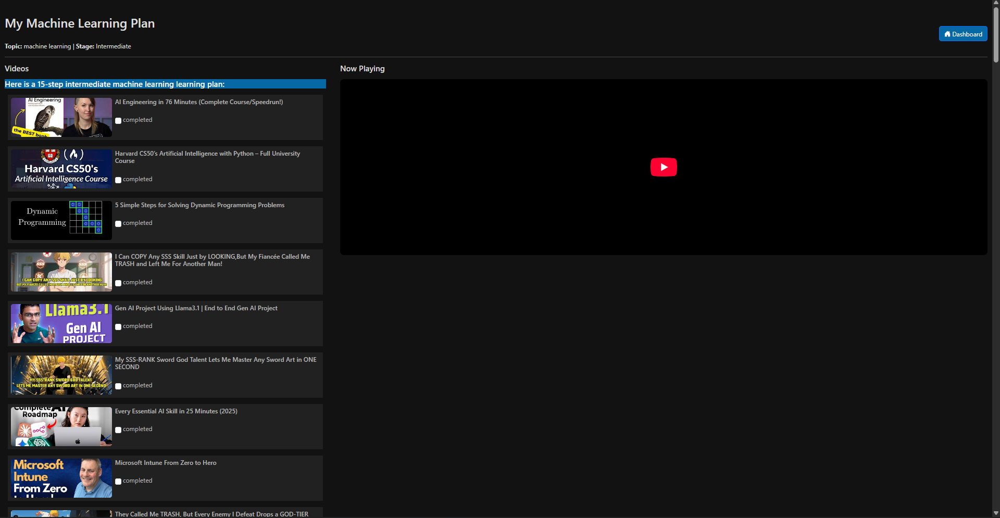

<p align="center">
    
</p>

#  StudyFlow

StudyFlow is a personal learning dashboard that helps you create, track, and manage mini-courses from YouTube.
It combines Bootstrap UI + Django backend + AI (Groq) to generate structured learning roadmaps.

## Features

- Dashboard with sidebar navigation
- Search bar to enter any topic you want to learn
- Auto-generated mini-courses (20 YouTube videos per topic)
- AI-generated learning roadmap – organizes videos into a logical order
- Bootstrap styling for responsive UI

## 🛠️ Tech Stack

- Frontend: Bootstrap 5, Custom CSS
- Backend: Django 5
- Database: SQLite (default)
- APIs: YouTube Search API (youtubesearchpython)
- AI: Groq LLaMA for roadmap generation

## Screenshots







## 📂 Project Structure
```
StudyFlow/
│── .gitignore
│── .vscode
│   │── settings.json
│── README.md
│── base
│   │── __init__.py
│   │── admin.py
│   │── apps.py
│   │── models.py
│   │── static
│   │   │── base
│   │   │   │── css
│   │   │   │   │── course-result.css
│   │   │   │   │── course_form.css
│   │   │   │   │── dashboard.css
│   │   │   │── media
│   │── templates
│   │   │── base
│   │   │   │── course-result.html
│   │   │   │── course_form.html
│   │   │   │── dashboard.html
│   │── tests.py
│   │── urls.py
│   │── views.py
│── core
│   │── __init__.py
│   │── asgi.py
│   │── settings.py
│   │── urls.py
│   │── views.py
│   │── wsgi.py
│── manage.py
│── requirements.txt
│── show_structure.py
│── static
│   │── css
│   │   │── home.css
│   │── media
│   │   │── bg1.jpg
│   │   │── bg2.jpg
│   │   │── bg3.jpg
│   │   │── learning.png
│   │   │── pfd.jpg
│   │   │── studyflow.ico
│   │   │── studyflow.png
│── templates
│   │── base.html
│   │── home
│   │   │── home.html
│── users
│   │── __init__.py
│   │── admin.py
│   │── apps.py
│   │── forms.py
│   │── models.py
│   │── static
│   │   │── users
│   │   │   │── css
│   │   │   │   │── style.css
│   │   │   │── media
│   │   │   │   │── studyflow.png
│   │── templates
│   │   │── users
│   │   │   │── signin.html
│   │   │   │── signup.html
│   │── tests.py
│   │── urls.py
│   │── views.py
```
## ⚡ Installation

Clone the repo

```git clone https://github.com/yourusername/studyflow.git
cd studyflow
```

Create & activate a virtual environment
```
python -m venv venv
source venv/bin/activate   # Linux / Mac
venv\Scripts\activate      # Windows
```

Install dependencies

```pip install -r requirements.txt```


Set environment variables
Create a .env file in the root:
```
YOUTUBE_API_KEY=your_youtube_api_key
GROQ_API_KEY=your_groq_api_key
```

Run migrations
```
python manage.py migrate
```

Start the server
```
python manage.py runserver
```
